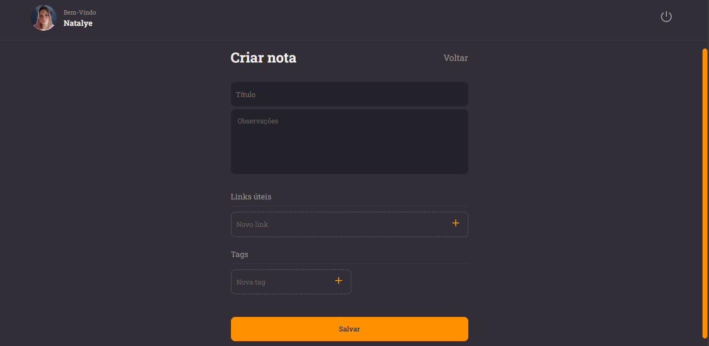
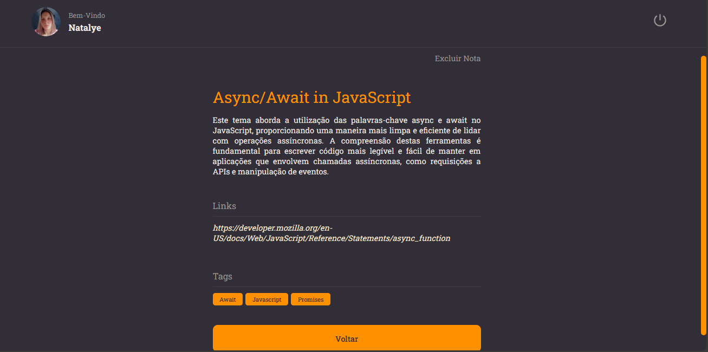

<h1 align="center">RocketNotes</h1>

Welcome to RocketNotes - Your incredible note-taking application!

> Status: developing 🚧

<h4 align="center">SignUp page</h4>

<h4 align="center">SignIn page</h4>

<h4 align="center">Home page</h4>

<h4 align="center">New note page</h4>

<h4 align="center">Note details page</h4>

<h4 align="center">Profile page</h4>

## Project Overview

RocketNotes is a front-end project developed to provide an efficient and enjoyable experience in creating and organizing notes. The simple and intuitive interface allows users to manage their notes quickly and effectively.

## Key Features

- **Note Creation**: Easily create new notes with a simple and user-friendly text editor.
- **Organization**: Sort and group your notes for easy access.

## Technologies Used

- **React and React-DOM**: Library for building user interfaces.
- **Vite**: Framework for rapid React project development.
- **Styled-Components**: Library for styling React components.
- **Axios**: HTTP client for making API requests.
- **Eslint**: Tool for identifying and correcting code patterns.
- **@types/react and @types/react-dom**: Typings for React.
- **react-icons**: Icon library for React.
- **react-router-dom**: Routing for navigation between pages.

## Directory Structure

- **src/components**: Reusable React components.
- **src/pages**: Main application pages.
- **src/routes.jsx**: Route configuration for authenticated and non-authenticated users.
- **src/services**: Services such as Axios for API interaction.
- **src/styles**: Global styles and themes.

## Project Pages

- **Signin**: Login page.
- **Signup**: Registration page.
- **Home**: Main page displaying notes.
- **Details**: Page with details of the created note.
- **New**: Page for creating a new note.
- **Profile**: User profile page.

## Routes

Routes are defined in the `src/routes.jsx` file. There are specific routes for authenticated and non-authenticated users.

## Contribution

Contributions are welcome! Feel free to open issues and pull requests.
